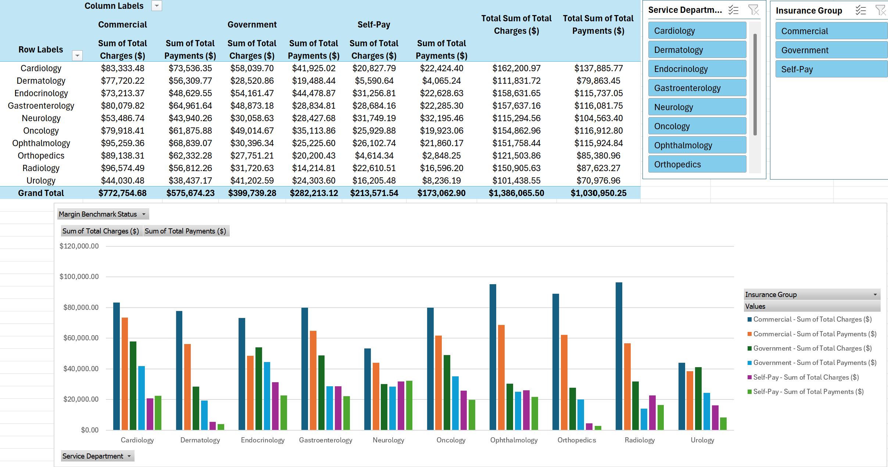

# Revenue Integrity Excel Project

Mock healthcare revenue integrity dataset demonstrating advanced Excel skills:
- **XLOOKUP** with named ranges for APC code & payer group lookups
- Automated KPI calculations: Payment Variance, Net Margin, Margin %
- Conditional formatting with red negative values
- Interactive Pivot Table dashboard with slicers for quick analysis

**Purpose:** Proof-of-concept for analyzing and visualizing healthcare financial data in Excel.

